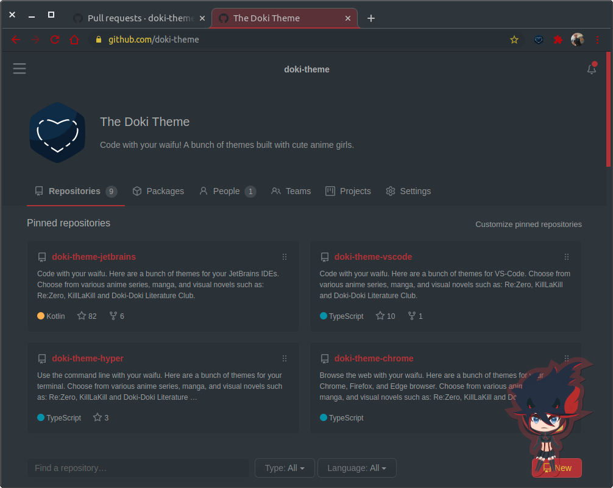

# Usage/Installation Preview

## Prerequisites for full experience

- [Stylus](https://add0n.com/stylus.html) for [Chrome](https://chrome.google.com/webstore/detail/stylus/clngdbkpkpeebahjckkjfobafhncgmne)
- [The Doki Theme for Chrome](https://github.com/doki-theme/doki-theme-chrome)

## Installation

1. Navigate to the [themes](https://github.com/doki-theme/doki-theme-github/tree/master/themes) directory, in GitHub at the root of this repository.
1. Select the `user.css` file of your desired theme.
1. View the `Raw` file.
1. You will be presented with the Stylus installation page, so choose `Install Style`.

## About

Expand your Doki Theme experience when browsing the web, by adding your Best Girl to GitHub!
This works best in combination with [the Doki Theme for Chrome](https://github.com/doki-theme/doki-theme-chrome).

## Contributing

If you want to get your workstation set up to work on the plugin,
then you'll want to check out the [CONTRIBUTING.md](./CONTRIBUTING.md) for instructions on what is needed.

## Acknowledgements

Thank you [GitHub Dark](https://github.com/StylishThemes/GitHub-Dark) and all the authors for providing the initial lift to making this experience possible!
